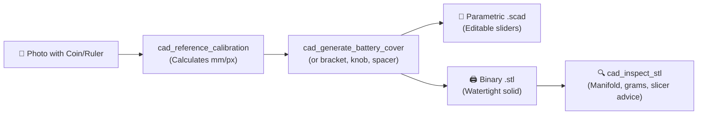

# 📐 Gemini CAD MCP (`gemini-cad-mcp`)

> **Model Context Protocol (MCP) server for Optical Photo-to-CAD, Parametric OpenSCAD synthesis, and 3D Printable STL generation.**

[](LICENSE)
[-brightgreen.svg)]()
[]()

---

## 💡 The Spark

This project was inspired by a community exchange in the Google Gemini Ultra Discord between **Shane** (`@Gaming2Gamers`) and **Jack from Google** (Gemini Support):

> **ShaneMKelley [G2G]:** *"I want to eventually be able to take a picture of a broken idk battery cover? and have Gemini be able to take the image and make a new one. [Ultra-Suggestion]"*
>
> **JackFromGoogle:** *"Okay snapping a photo of a missing TV remote battery cover and having Gemini spit out a ready-to-print .STL file is a 10/10 [Ultra-Suggestion]—officially logging that one! 📝🔥 (Every missing remote backplate in the world is trembling right now 😂)*
> 
> *Until native photo-to-STL lands, a fun trick you can test right now is putting a ruler or a quarter next to the broken slot in the photo so Gemini can calculate the exact millimeter scale, and having it generate the OpenSCAD parametric code with the clip tolerances! 🛠️📐"*

`gemini-cad-mcp` turns Jack's trick into an **automated, production-grade MCP tool suite**. Any multimodal AI (Gemini, Claude, Antigravity) equipped with this server can inspect a photo containing a reference coin or ruler, calculate sub-millimeter cavity dimensions, and instantly generate both:
1. **Parametric OpenSCAD (`.scad`) code** with tunable clearance and tolerance sliders.
2. **Ready-to-print watertight binary STL (`.stl`) meshes** compiled on the fly.

---

## 🚀 Key Capabilities



* 🪙 **Optical Scale Calibration (`cad_reference_calibration`)**:
  * US Quarter ($24.26\text{ mm}$), Penny ($19.05\text{ mm}$), Nickel ($21.21\text{ mm}$), Dime ($17.91\text{ mm}$)
  * Euro 1€ / 2€, UK £1 coin
  * Standard ID-1 Credit Card ($85.60\text{ mm} \times 53.98\text{ mm}$)
  * Direct Metric/Imperial Ruler markings, or any custom millimeter reference
  * Automatically calculates **FDM printing fit offsets** (`slide_fit = 0.25mm`, `snap_fit = 0.20mm`, `press_fit = 0.10mm`).

* 🔋 **Parametric Battery Cover Generator (`cad_generate_battery_cover`)**:
  * Solves the lost remote backplate problem.
  * Filleted outer shell, rear alignment retention prongs, front flexible cantilever snap-fit clip, and ergonomic thumb traction ribs.

* 🛠️ **Universal Replacement Part Generators**:
  * `cad_generate_bracket`: Structural L-brackets and flat plates with countersunk screw holes and $45^\circ$ reinforcing gussets.
  * `cad_generate_knob`: Potentiometer and appliance rotary knobs with D-shaft sockets, indicator pointer notches, and perimeter fluting.
  * `cad_generate_spacer`: Round and hexagonal bushings, standoffs, and washers with precision through-holes.

* ⚡ **Dual-Engine Architecture (Zero External Dependencies)**:
  * **Embedded Pure JS 3D CSG Engine**: Generates valid, watertight, binary STL meshes directly out of the box with **zero required software installations**.
  * **OpenSCAD CLI Auto-Bridge**: If OpenSCAD is installed on the host system, the MCP will seamlessly use it for headless rendering and compilation.

* 🔍 **Mesh Printability Inspector (`cad_inspect_stl`)**:
  * Watertight 2-manifold verification (checks for open boundary holes).
  * Calculates bounding box ($X \times Y \times Z$ in mm), exact surface area ($mm^2$), and volume ($cm^3$) via Gauss's divergence theorem.
  * Estimates filament consumption in grams (PLA, PETG, ABS) and provides slicer orientation recommendations.

---

## 📦 Installation & Setup

Clone the repository:
```bash
git clone https://github.com/ssfdre38/gemini-cad-mcp.git
cd gemini-cad-mcp
```

*(No `npm install` needed! The server runs on pure Node.js stdlib with zero external npm dependencies).*

### Add to Gemini CLI / Antigravity

In your MCP configuration file (`mcp_config.json` or Antigravity tool config):
```json
{
  "mcpServers": {
    "gemini-cad": {
      "command": "node",
      "args": ["C:/Users/admin/source/gemini-cad-mcp/index.js"]
    }
  }
}
```

### Add to Claude Desktop

In `%APPDATA%\Claude\claude_desktop_config.json`:
```json
{
  "mcpServers": {
    "gemini-cad": {
      "command": "node",
      "args": ["C:/Users/admin/source/gemini-cad-mcp/index.js"]
    }
  }
}
```

---

## 🧪 Testing & Verification

Run the master test suite:
```bash
npm test
# or: node test/run-tests.js
```

Generate a sample TV remote battery cover in `./output`:
```bash
node index.js --demo
```

Check host environment and OpenSCAD status:
```bash
node index.js --check
```

---

## 🛠️ MCP Tool Reference

| Tool Name | Purpose | Key Inputs |
| :--- | :--- | :--- |
| `cad_reference_calibration` | Converts photo pixels to real mm using a reference object | `referenceType`, `pixelSpan`, `measuredPixels` |
| `cad_generate_battery_cover` | Generates parametric remote cover (`.scad` + `.stl`) | `length`, `width`, `thickness`, `clearance`, `clipWidth` |
| `cad_generate_bracket` | Generates structural L-bracket with gusset | `leg1Length`, `leg2Length`, `width`, `thickness`, `gusset` |
| `cad_generate_knob` | Generates replacement knob with D-shaft socket | `diameter`, `height`, `shaftDiameter`, `dFlatDepth` |
| `cad_generate_spacer` | Generates standoff bushing or washer | `outerDiameter`, `innerDiameter`, `height`, `shape` |
| `cad_inspect_stl` | Validates STL manifoldness, dimensions, and filament weight | `stlPath` |
| `cad_check_system` | Reports OpenSCAD CLI status and supported standards | None |

---

## 📄 License

MIT © Daniel Elliott ([@ssfdre38](https://github.com/ssfdre38))
